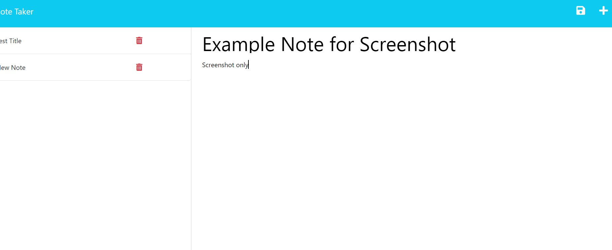
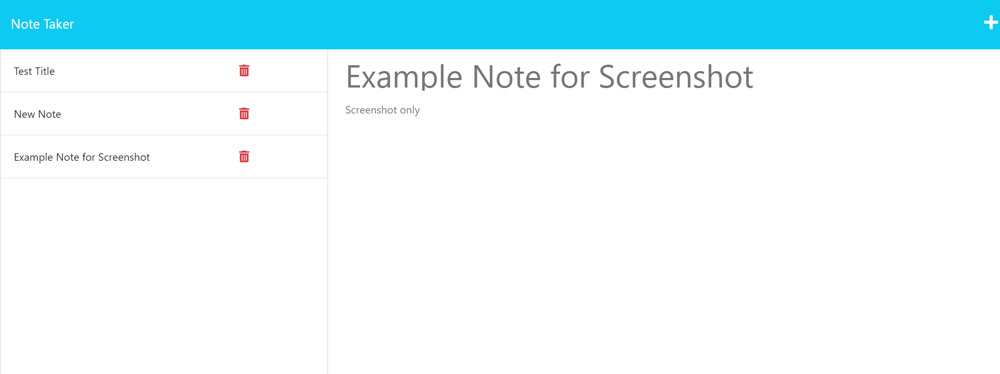

# <Note_Taker>

## Description

THis challenge was a definite, well, challenge! I knew going in that I didn't know routing all that well quite yet, and this was an excellent opportunity to brush up all of those skills. I feel much more confident with those skills now, particularly as they relate to interacting with a JSON database. It was also an exercise in error troubleshooting, alot of time was spent hunting down answers via technical documents and stack overflow. 

## Table of Contents (Optional)

If your README is long, add a table of contents to make it easy for users to find what they need.

- [Installation](#installation)
- [Usage](#usage)
- [Credits](#credits)
- [License](#license)

## Installation

1. Upon opening the app, check to make sure you have a package.json file on the lefthand side. If not, open the terminal and type "npm init -y".
2. Still in the terminal, type " npm i". This will install all necessary node packages. Check to make sure your dependencies list matches this: "dependencies":  "express": "^4.16.4",
    "uuid": "^3.4.0"

## Usage

## Credits

Sandra Smith, for the excellent tutoring session. 

## License

MIT License

Copyright (c) 2023 Kalani Jones

Permission is hereby granted, free of charge, to any person obtaining a copy
of this software and associated documentation files (the "Software"), to deal
in the Software without restriction, including without limitation the rights
to use, copy, modify, merge, publish, distribute, sublicense, and/or sell
copies of the Software, and to permit persons to whom the Software is
furnished to do so, subject to the following conditions:

The above copyright notice and this permission notice shall be included in all
copies or substantial portions of the Software.

THE SOFTWARE IS PROVIDED "AS IS", WITHOUT WARRANTY OF ANY KIND, EXPRESS OR
IMPLIED, INCLUDING BUT NOT LIMITED TO THE WARRANTIES OF MERCHANTABILITY,
FITNESS FOR A PARTICULAR PURPOSE AND NONINFRINGEMENT. IN NO EVENT SHALL THE
AUTHORS OR COPYRIGHT HOLDERS BE LIABLE FOR ANY CLAIM, DAMAGES OR OTHER
LIABILITY, WHETHER IN AN ACTION OF CONTRACT, TORT OR OTHERWISE, ARISING FROM,
OUT OF OR IN CONNECTION WITH THE SOFTWARE OR THE USE OR OTHER DEALINGS IN THE
SOFTWARE.

---

🏆 The previous sections are the bare minimum, and your project will ultimately determine the content of this document. You might also want to consider adding the following sections.

## How to Contribute
If you've like to contribute to this project, please reach out! We are incredibly proud of the work, and also of the numerous future opportunities for future features it could hold.

Before you reach out, please be familiar with the Contributor Covenant and the code of conduct within.

Link to GITHUB repo can be found here: https://github.com/kalaniJ94/Note_Taker

